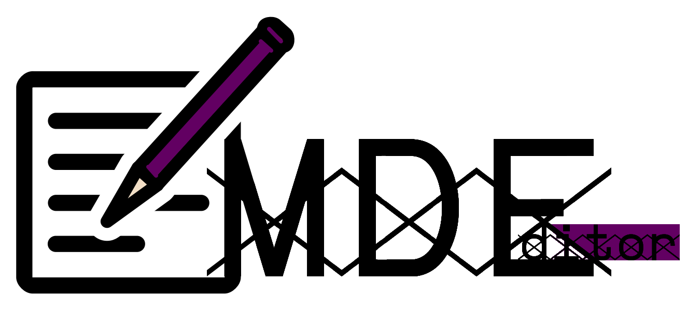

# MDEditor



A free and opensource MarkDown editor, with the support of exporting HTML and PDF.

## Installation

**Automatic installation and running in GNU/Linux:**

Installing Requirements:

* `php` : e.g install with `sudo apt install php`
* `php-mbstring` extention: e.g install with `sudo apt install php-mbstring` or uncomment `extention=php_mbstring.dll` in `php.ini` file for Windows.

Installing Project:
```shell
git clone https://github.com/TadavomnisT/MDEditor.git
cd MDEditor
chmod +x start_gui.sh
```

Running GUI:
```shell
./start_gui.sh
```

----------------------------


**Installing and running manually:**

* Install the requirements:
```shell
sudo apt install php
sudo apt install php-mbstring
```

* Download the source-code:
```shell
git clone https://github.com/TadavomnisT/MDEditor.git
```

* Start GUI:
```shell
cd MDEditor
php -S 127.0.0.1:8989
```
Then open the url `http://127.0.0.1:8989/` with a browser.


* **Using as library**:

Just include `MDEditor.php` and use it:
```php
require_once "MDEditor.php";
$mde = new MDEditor;
```

## Screenshots


* Desktop GUI:


* Resposive Mobile GUI:


## Library API

Please refer to `./test` directory for more examples.
```php
<?php

require_once "MDEditor.php";
$mde = new MDEditor;

$mde->setDocumentStyle("light");
$html = $mde->md2html( "./tests/sample.md" );
file_put_contents("./tests/test_" . $mde->getDocumentStyle() . $mde->getDocumentWidth() . ".html", $html);
$pdf = $mde->html2pdf( "./tests/test_" . $mde->getDocumentStyle() . $mde->getDocumentWidth() . ".html" );
file_put_contents("./tests/test_" . $mde->getDocumentStyle() . $mde->getDocumentWidth() . ".pdf", $pdf);

$mde->setDocumentStyle("dark_black");
$html = $mde->md2html( "./tests/sample.md" );
file_put_contents("./tests/test_" . $mde->getDocumentStyle() . $mde->getDocumentWidth() . ".html", $html);
$pdf = $mde->html2pdf( "./tests/test_" . $mde->getDocumentStyle() . $mde->getDocumentWidth() . ".html" );
file_put_contents("./tests/test_" . $mde->getDocumentStyle() . $mde->getDocumentWidth() . ".pdf", $pdf);

$mde->setDocumentStyle("toggle_darkmodeblack_dark");
$html = $mde->md2html( "./tests/sample.md" );
file_put_contents("./tests/test_" . $mde->getDocumentStyle() . $mde->getDocumentWidth() . ".html", $html);
$pdf = $mde->html2pdf( "./tests/test_" . $mde->getDocumentStyle() . $mde->getDocumentWidth() . ".html" );
file_put_contents("./tests/test_" . $mde->getDocumentStyle() . $mde->getDocumentWidth() . ".pdf", $pdf);

$mde->setDocumentWidth(960);

$mde->setDocumentStyle("toggle_darkmodegray_white");
$html = $mde->md2html( "./tests/sample.md" );
file_put_contents("./tests/test_" . $mde->getDocumentStyle() . $mde->getDocumentWidth() . ".html", $html);
$pdf = $mde->html2pdf( "./tests/test_" . $mde->getDocumentStyle() . $mde->getDocumentWidth() . ".html" );
file_put_contents("./tests/test_" . $mde->getDocumentStyle() . $mde->getDocumentWidth() . ".pdf", $pdf);
?>
```

## Todo-List
+ Add support of Mediawiki
+ Add Sizes for html in GUI
+ Add support of Hebrew
+ Make Headings HyperLink-able by HTML#
+ Fix HTML code and table color problems
+ Add font Embedding feature
+ Add darkmode for GUI
+ Add Drag/Drop option for GUI
+ Add Upload option for GUI

## Available document styles

|Available document styles:|
|--------|
|light|
|light_960px|
|dark_black|
|dark_black_960px|
|dark_gray|
|dark_gray_960px|
|toggle_darkmodeblack_white|
|toggle_darkmodeblack_white_960px|
|toggle_darkmodegray_white|
|toggle_darkmodegray_white_960px|
|toggle_darkmodeblack_dark|
|toggle_darkmodeblack_dark_960px|
|toggle_darkmodegray_dark|
|toggle_darkmodegray_dark_960px|


## Acknowledgements

**This project is powered by:**
* Parsdown : https://github.com/erusev/parsedown
* Mpdf : https://github.com/mpdf/mpdf
* Html2Text : https://github.com/mtibben/html2text
* Text_LanguageDetect : https://github.com/pear/Text_LanguageDetect
* CodeHive's simple markdown WYSIWYG toolbar : https://codepen.io/michaellee/pen/JdbqGW

**Inspiration:**
* Remarkable : https://github.com/jamiemcg/Remarkable
  
**Contributors:**
* [@Tadavomnist](https://github.com/TadavomnisT) (behrad.b)
* [@hctilg](https://github.com/hctilg) (Mahi)
* [@amiria703](https://github.com/amiria703) (Amir Hossein "Amiria" Maher)

## License:

* GPLv3
